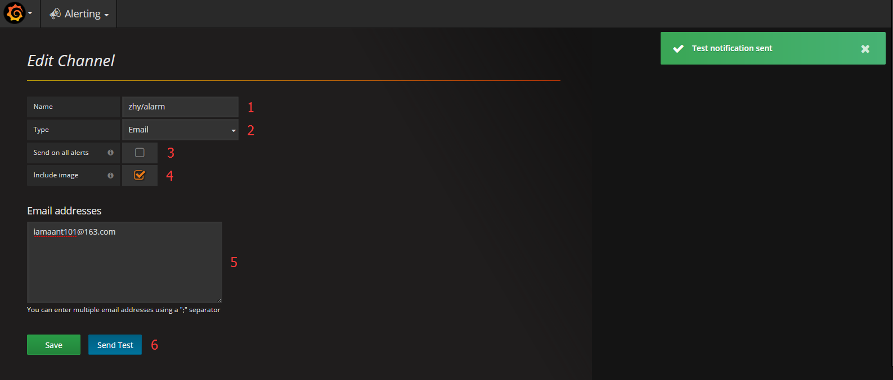
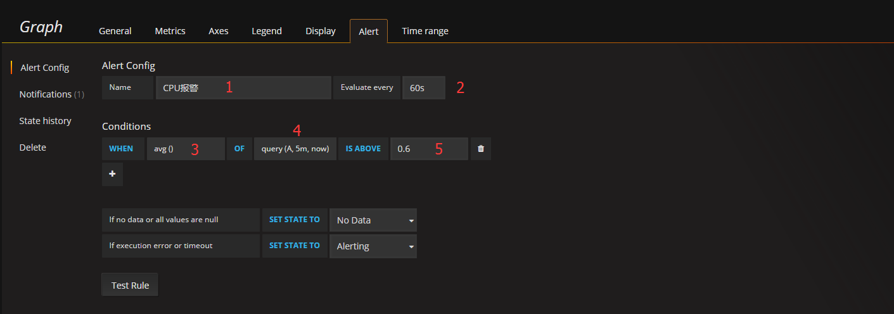

# 开启163邮箱的客户端授权验证
```
登录163邮箱 -> 设置 -> 帐号与邮箱中心 -> 客户端授权密码 -> 选择开启 -> 设置授权码(auth_code)
```

# 配置smtp
```
# cd /etc/grafana

# vim grafana.ini
#################################### SMTP / Emailing ##########################
[smtp]
enabled = true
host = smtp.163.com:25
user = xxx@163.com
# If the password contains # or ; you have to wrap it with trippel quotes. Ex """#password;"""
password = auth_code
cert_file =
key_file =
skip_verify = true
from_address = xxx@163.com
from_name = Grafana
# EHLO identity in SMTP dialog (defaults to instance_name)
;ehlo_identity = dashboard.example.com

[emails]
;welcome_email_on_sign_up = false

# systemctl restart grafana-server
```

# 配置Notifications
```
Alerting -> Notification channels -> New Channel 
```



```
1 Name: 通知的名称。

2 Type: 通知以哪种类型发送，此处选Email。

3 Send on all alerts: 是否发送所有的报警。

4 Include image: 是否发送当前统计图表的图片。

5 Email addresses: 接收者的Email列表。

6 Send Test: 测试邮件是否发送成功。
```

# 配置Alert
#### 需要先配置Data Sources，Dashboards



```
1 Name: 报警的名称，在邮件中作为邮件标题显示。

2 Evaluate every: 执行频率，默认60秒。

3 WHEN: 统计函数，默认avg。

4 OF: query（A,5m,now），字母A代表选择的metrics中配置的sql；5m代表5分钟之前的时间起始点；now为时间的结束点。

5 IS ABOVE: 预警临界点，如果超过设置的值，就报警。
```


```
1 Send to: 通知的接收者，即此前配置的Notifications。

2 Message: 通知的内容，在邮件中作为邮件内容显示。
```