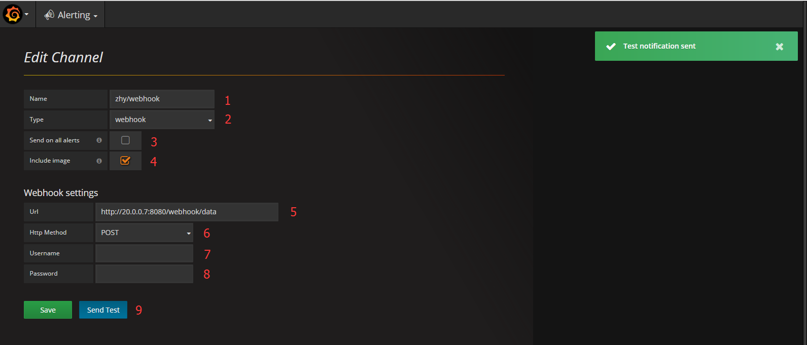
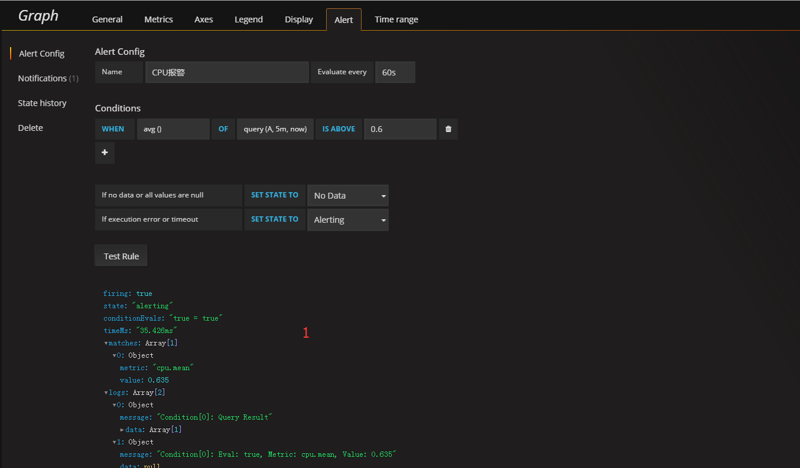
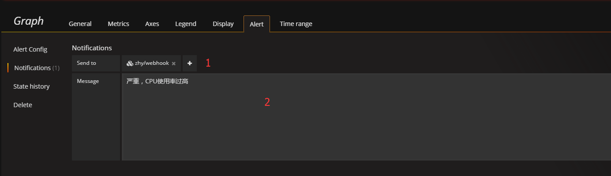

# 配置Notifications
```
Alerting -> Notification channels -> New Channel
```



```
1 Name: 通知的名称。

2 Type: 通知以哪种类型发送，此处选webhook。

3 Send on all alerts: 是否发送所有的报警。

4 Include image: 是否发送当前统计图表的图片。

5 Url: 第三方url接口。

6 Http Method: POST | GET。

7 Username: 用户名，可为空。

8 Password: 密码，可为空。

9 Send Test: 测试数据是否能成功发送到指定的url接口。
```

```
点 Send Test 按钮之后，后台接收到的json数据：

{
    "evalMatches": [
        {
            "value": 100,
            "metric": "High value",
            "tags": null
        },
        {
            "value": 200,
            "metric": "Higher Value",
            "tags": null
        }
    ],
    "imageUrl": "http://grafana.org/assets/img/blog/mixed_styles.png",
    "message": "Someone is testing the alert notification within grafana.",
    "ruleId": 0,
    "ruleName": "Test notification",
    "ruleUrl": "http://localhost:3000/",
    "state": "alerting",
    "title": "[Alerting] Test notification"
}
```

# 配置Alert
#### 需要先配置Data Sources，Dashboards



```
1 Test Rule: 测试规则的json数据。
```



```
1 Send to: 通知的接收者，即此前配置的Notifications。

2 Message: 通知的内容，在json中作为message字段的值。
```

```
触发报警时，后台接收到的json数据：

{
    "evalMatches": [
        {
            "value": 0.635,
            "metric": "cpu.mean",
            "tags": null
        }
    ],
    "message": "严重，CPU使用率过高",
    "ruleId": 1,
    "ruleName": "CPU报警",
    "ruleUrl": "http://localhost:3000/dashboard/db/zhy-monitor-influxdb?fullscreen&edit&tab=alert&panelId=1&orgId=1",
    "state": "alerting",
    "title": "[Alerting] CPU报警"
}
```